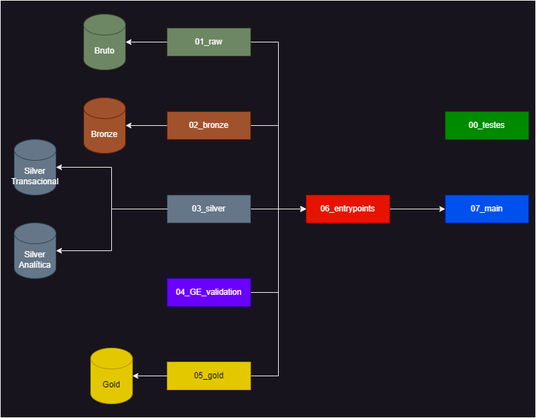

# Projeto Analytics Engineering

Este projeto tem como objetivo construir uma pipeline de dados para o conjunto de dados do Airbnb sobre hospedagens na cidade do Rio de Janeiro ([link](https://insideairbnb.com/get-the-data/) - arquivos listings, calendar e reviews.)

# Objetivos Específicos do Projeto:

* Estruturar os dados nas camadas Raw, Bronze, Silver e Gold;

* Utilizar querys em SQL para transformar os dados das camadas Silver para Gold;

* Utilizar o Great Expectations para criar validações dos dados, seja dos tipos de dados das colunas, seja de validações específicas.

# Objetivos Pessoais:

* Tabelas na camada Gold devem ter, pelo menos, uma agregação de duas tabelas e devem ser direcionadas para responder alguma questão de negócios.

* Estrutura do projeto feira de maneira modular

* Desenvolver na plataforma Databricks (Community)

# Objetivos Futuros

O projeto foi realizado em grupo por: Amanda Almeida e Angélica Salvino, Naiara Andrade e Nícolas Sartor Parisotto. Inicialmente os integrantes se reuniram e cada um realizou seu projeto (código, tecnologias, propostas), baseado em algumas diretrizes e direcionamentos gerais do grupo. Agora, a ideia é convergir os projetos para criar uma nova aplicação.

# Estrutura do Projeto

O projeto foi feito de modo modularizado, onde cada notebook possui responsabilidades sobre aquele ponto do projeto. Cada notebook é chamado em *Entrypoints* que por sua vez é chamado no notebook *Main*. A idéia é que o projeto funcione como uma parte de um sistema e para execução do processo, apenas seja executado o notebook *Main* e o projeto irá rodar do início ao fim, com suas partes executando objetivos específicos.

## 00_testes

Como o próprio nome diz, é o ambiente de testes. Seja para transformações, seja para visualização. As funções de cada arquivo nascem a partir de comandos e células desse notebook, que posteriormente são transferidas para as respectivas partes.

## 01_raw

Armazenamento do arquivo bruto. Nessa caso, são 3 arquivos em *.csv* extraidos diretamente do site.

## 02_bronze

Conversão dos arquivos *.csv* em *.parquet*, com algumas opções para correção da visualização e das colunas dos arquivos *.csv*.

## 03_silver

A camada silver possui duas etapas. 

A primeira é a transformação da camada bronze para a camada silver, com algumas transformações, mas mantendo o contexto dos dados (Silver Transacional). Nesse ponto, a camada é salva em arquivo *.parquet*

A segunda é a transformação para tabelas de banco de dados, mas um contexto analítico. Nesse caso não foram realizadas transformações específicas, mas a ideia central é que, caso algum contexto de negócio exija, seria realizado nessa etapa (Silver Analítica).

## 04_GE_validation

Utilização do Great Expectations relacionado à camada silver (Silver Transacional), onde são verificados os tipos de arquivos e questões específicas dos dados de cada coluna.

## 05_gold

A partir da camada silver (Silver Analítica), São criadas tabelas de acordo com perguntas e contextos de negócio. Nesse caso, as tabelas criadas correspondem às seguintes questões:

* Receita média mensal por bairro e tipo de propriedade
* Relação entre a quantidade de reviews e a taxa de ocupação de um imóvel
* Bairros com maior número de superhosts e como a taxa de ocupação deles se compara com a de outros hosts
* Nota média dos imóveis por bairro e tipo de acomodação
* Impacto da quantidade de comodidades na quantidade de reviews e ocupação dos imóveis

## 06_entrypoints

Tem como objetivo centralizar as entradas de notebooks, bibliotecas e instalação de dendências. Também instancia as variáveis de caminhos e nomes específicos e necessários para os demais notebooks.

## 07_main

Notebook de execução, de maneira mais compacta e direta de toda a pipeline de dados.